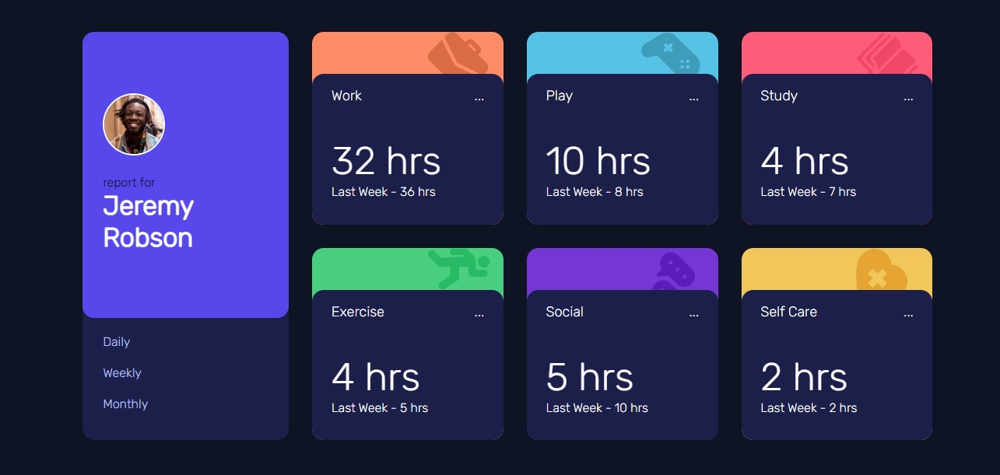
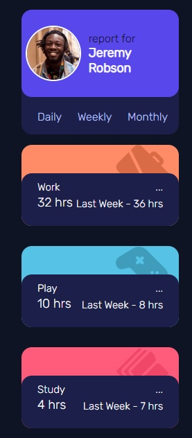
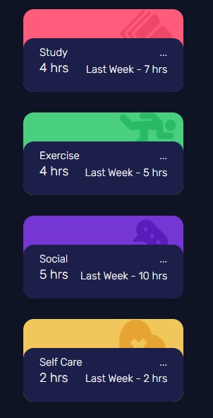

# Chanllege - Time tracking dashboard
* Desktop Design

* Mobile Design

 

* Deploy: URL

# Process

## Built-With
    * HMTL5
    * CSS
## How i did it
First at all i had to center de container of the card with a  tag "main",styled the body to made it; after this i split the container in two parts, one with the card profile and another in wich i put the other 6 cards, to made it responsive i used display grid with size units in %.
In the mobile design i used media-query.

## Author (About me)
I am Lautaro Carreño a full-stack Developer in JS, i like so much make great designs with amazings animations, if you wanna see another proyects mine check my portfolio: https://portafolio-personal-steel.vercel.app/

Thanks So much for see this proyect and have a beautiful day